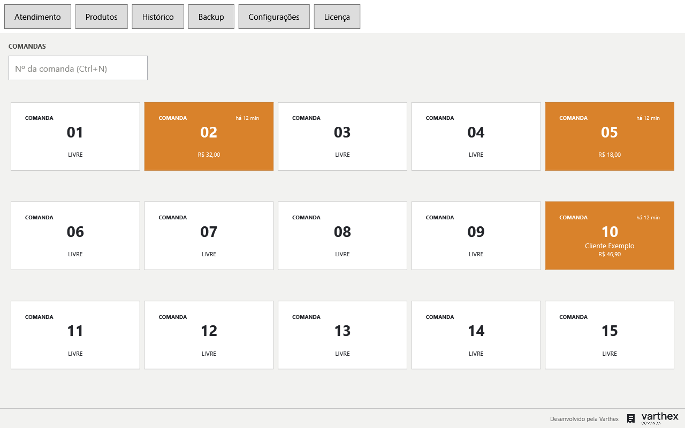
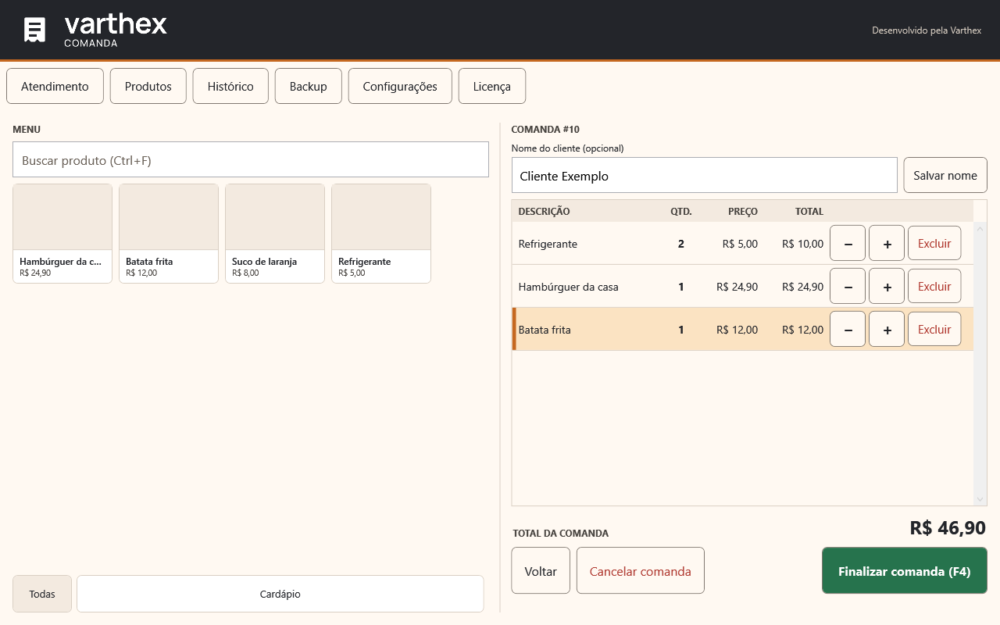
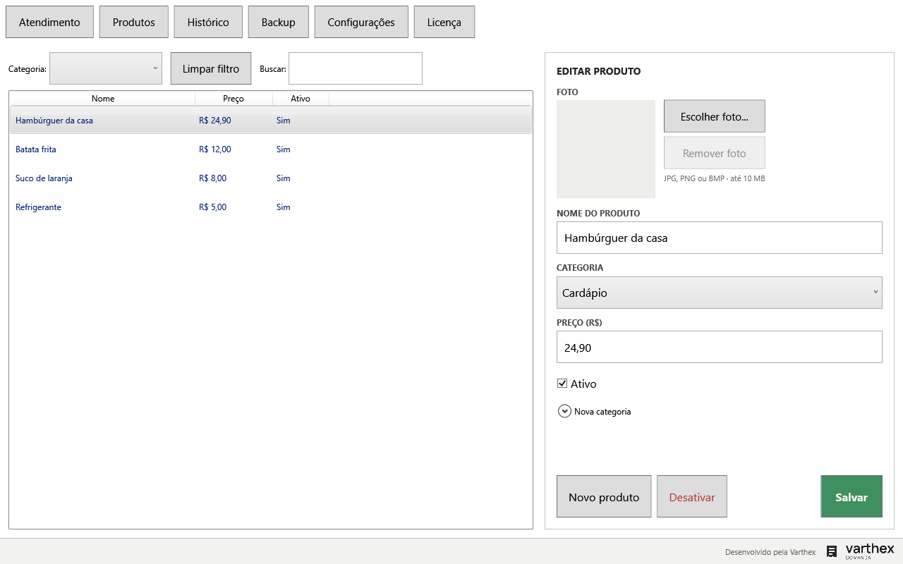
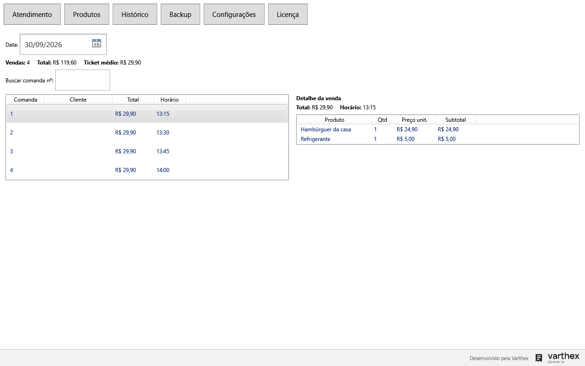

<div align="center">

# Varthex Comanda


**Um aplicativo desktop para Windows que controla o consumo por comandas
numeradas: você lança os itens, ele calcula o total e mostra o valor para você
digitar na maquininha — sem nunca tocar em pagamento.**



</div>

Pensado para o balcão de um pequeno negócio: uma grade com todas as comandas
(livres ou abertas), um menu de produtos com foto e um carrinho em tabela, tudo
com botões grandes o bastante para o toque. Funciona 100% offline, com os dados
num banco SQLite local.

[Abrir design no Canva](https://www.canva.com/design/DAHWxyICQfE/IsxM-jV_WbNmWiN2n2sUjQ/edit?ui=eyJFIjp7Im0iOnRydWUsIkE_IjoibiJ9LCJLIjp7IkEiOiIyZjNkNGUzNC1jMjE1LTRiMTQtYjI0Ni05ODU0Mjc5NjI3MjAifX0)

## Windows — versão 1.2.3 com produtos de teste

[](https://github.com/arthurtvrs10/Varthex-Orders/releases/download/v1.2.3-demo/VarthexComanda-Demo-1.2.3-Setup-win-x64.exe)

O download principal é a **edição Demonstração 1.2.3 para Windows 64 bits**, com
**12 produtos e imagens realistas geradas por IA com fundo branco**: pastéis de carne,
queijo, frango com requeijão e pizza; coxinha, kibe, bolinha de queijo, batata frita,
refrigerantes cola, guaraná e laranja, além de água mineral. Preços fictícios e editáveis.

Instala para o usuário atual, sem administrador, e inclui o .NET. Abra pelo atalho
**Comanda Demonstração**. Funciona offline e requer ativação; reutiliza a licença
existente do mesmo computador.

Os dados ficam em `%LOCALAPPDATA%\VarthexComandaDemo`, separados da edição normal.
O catálogo é criado uma única vez; reabrir, atualizar ou reinstalar preserva suas alterações.
Feche a outra edição antes de abrir. O instalador não possui assinatura de código;
o Windows pode exibir um aviso de aplicativo desconhecido.

[Notas da versão](downloads/demo/README.md) · [SHA-256](downloads/demo/VarthexComanda-Demo-1.2.3-Setup-win-x64.exe.sha256) · [Catálogo e imagens](demo/README.md)

**Alternativa sem produtos de teste:** [baixar edição normal 1.2.2](https://github.com/arthurtvrs10/Varthex-Orders/releases/download/v1.2.2/VarthexComanda-1.2.2-Setup-win-x64.exe).
Use essa edição para atualizar uma instalação normal existente; a demonstração é instalada separadamente.

## Android — gerador de chaves

[](https://raw.githubusercontent.com/arthurtvrs10/Varthex-Orders/main/downloads/android/Varthex-Licencas-1.0.0.apk)

O botão baixa o APK **Varthex Licenças 1.0.0**.

Aplicativo para **Android 8.0 ou superior**, exclusivo do responsável pelas licenças.
Gera chaves offline de **1, 2, 3 meses ou vitalícias**, com opções para copiar e compartilhar.

1. Baixe o APK no celular, abra o arquivo e permita a instalação quando solicitado pelo Android.
2. Importe a chave privada `.pem` do emissor original.
3. Informe o cliente, cole o código do computador e escolha o plano e a data inicial.
4. Confirme a autorização e toque em **Gerar chave de ativação**. Envie somente a licença gerada ao cliente.

A chave privada não está incluída no APK e não deve ser compartilhada com clientes.
A compatibilidade das licenças com o Windows foi validada; a instalação e a interface ainda precisam ser conferidas em um aparelho Android.

[Instruções completas](mobile/licencas/README.md) · [Verificar integridade (SHA-256)](downloads/android/Varthex-Licencas-1.0.0.apk.sha256)

## Telas

Telas do código atual, com cores originais, controles quadrados e marca no rodapé. Renderizadas diretamente pelo WPF com dados fictícios em memória, sem acessar o banco do usuário. O instalador 1.2.2 inclui este layout.



Dentro da comanda: nome do cliente, catálogo à esquerda e itens com total à direita. Os exemplos também mostram produtos sem foto.



Produtos: edição de nome, categoria, preço e foto opcional.



Histórico: vendas do dia, resumo e detalhe dos itens.

## Instalação

1. [Baixe a demonstração 1.2.3 para Windows 64 bits](https://github.com/arthurtvrs10/Varthex-Orders/releases/download/v1.2.3-demo/VarthexComanda-Demo-1.2.3-Setup-win-x64.exe).
2. Execute o `.exe` e siga o assistente em português; não é necessário instalar .NET ou usar administrador.
3. Abra **Comanda Demonstração**. Se solicitado, envie o código do computador ao responsável e informe a chave recebida.

**Atualizar:** feche o aplicativo e execute o novo instalador. Licença e dados são
preservados. **Desinstalar:** use Aplicativos Instalados do Windows; os dados são mantidos.

Para identificar o cliente, abra a comanda, preencha **Nome do cliente (opcional)**
e clique em **Salvar nome** (ou Enter). Para remover, deixe vazio e salve.
O nome aparece na grade, encerramento e histórico. Atualizar mantém a licença e os dados.

A ativação offline é obrigatória. O emissor de licenças e a chave
privada são exclusivos do responsável e nunca devem ser enviados ao cliente.
Veja [como emitir, ativar e renovar licenças](docs/docs/20-licenciamento-offline.md).

### Gerar o instalador Windows

Com SDK .NET 10 e Inno Setup 6 instalados, execute `.\scripts\gerar-instalador.ps1`.
O `.exe` e seu SHA-256 ficam em `artifacts`. A cópia versionada para distribuição
fica em `downloads/windows`. Não distribua a pasta `artifacts` inteira, pois ela
também pode conter a chave privada do emissor.

### ZIP alternativo para instalação manual

O script abaixo também gera um ZIP autocontido com scripts de instalação.
As instruções desta subseção referem-se somente a esse pacote alternativo.

**Gerar o pacote** (na máquina de desenvolvimento, que precisa do SDK do .NET 10):

```powershell
.\scripts\publicar.ps1
```

Isso lê a versão do `<Version>` do `VarthexComanda.Desktop.csproj`, publica em
`artifacts\publish\win-x64` e gera `artifacts\VarthexComanda-<versão>-win-x64.zip`
(hoje `VarthexComanda-1.2.2-win-x64.zip`, cerca de 66 MB). O parâmetro opcional
`-Saida <pasta>` troca a pasta `artifacts`. A pasta `artifacts\publish\win-x64`
é apagada a cada publicação; já os `.zip` de versões anteriores **acumulam** em
`artifacts` (apague os antigos à mão). Os arquivos `.pdb` não entram no pacote.

**Instalar** (no computador do balcão):

1. Extraia o `.zip` **inteiro** numa pasta (não execute de dentro do zip).
2. Dê dois cliques em `Instalar.cmd`.
3. O programa vai para `%LOCALAPPDATA%\Programs\VarthexComanda` e são criados
   os atalhos "Varthex Comanda" na Área de Trabalho e no Menu Iniciar. Para outra
   pasta ou sem atalhos, use no PowerShell:
   `.\Instalar.cmd -Destino "C:\Pasta\Outra" -SemAtalhos` (também aceita
   `-WhatIf`, para simular sem alterar nada).

**Atualizar:** feche o app, extraia o pacote novo e execute `Instalar.cmd`
de novo. Só os arquivos do programa são trocados; a versão anterior fica em
`%LOCALAPPDATA%\Programs\VarthexComanda.anterior` para o retorno manual.

**Desinstalar:** dê dois cliques em `Desinstalar.cmd` (na pasta do programa ou do
pacote; para outro destino, `.\Desinstalar.cmd -Destino "C:\Pasta\Outra"`). Remove
a pasta do programa **inteira** (não guarde arquivos seus ali), a cópia `.anterior`
e os atalhos.

**Os dados ficam separados do programa** (veja [Onde ficam os
dados](#onde-ficam-os-dados)): atualizar e desinstalar **nunca** apagam
`%LOCALAPPDATA%\VarthexComanda`. A variável de ambiente `VARTHEX_COMANDA_DADOS`
redireciona essa pasta (demonstrações e testes) e os scripts de instalação a
respeitam ao recusar destinos perigosos.

O passo a passo completo, o retorno à versão anterior e o diagnóstico estão em
[Operação e implantação](docs/docs/12-operacao-implantacao.md); as decisões de
publicação, em [Plataforma Windows e .NET](docs/docs/19-plataforma-windows-dotnet.md).

> **Para desenvolvedores:** rodar a partir do código exige o SDK do .NET 10 —
> `dotnet run --project backend/src/VarthexComanda.Desktop` (veja
> [Compilando](#compilando)).

## O que ele faz

| Tela | O que resolve |
|---|---|
| **Atendimento** | Grade fixa de comandas numeradas (20 por padrão, configurável). Cada card mostra se está **livre** ou **aberta**, há quanto tempo e o total parcial. Clicar abre a comanda; dentro dela, o **menu** (cards de produto com foto, filtrados por categoria) fica à esquerda e o **carrinho** em tabela à direita, com `−` / `+` / `Excluir` por linha. |
| **Encerramento** | **Finalizar comanda (F4)** mostra o total para digitar na maquininha e só encerra depois que você confirma que a cobrança foi aprovada fora do sistema. Se der erro na maquininha, a comanda continua aberta. |
| **Produtos** | Cadastro em dois modos (**novo** / **edição**) com foto, nome, categoria e preço. Desativar em vez de apagar, para não quebrar o histórico. |
| **Histórico** | Vendas por dia, busca por número, detalhe dos itens e resumo do dia (quantidade, total e ticket médio). |
| **Backup** | Cópia automática na primeira abertura do dia e ao fechar o app, cópia manual (inclusive numa pasta externa), validação e restauração. |
| **Configurações** | Nome do estabelecimento, quantidade de comandas e pasta de backup externa. |

### Foto do produto

Cada produto pode ter uma foto (JPG, PNG ou BMP, até 10 MB). O app **copia** a
imagem para a própria pasta de dados — o arquivo original nunca é alterado — e o
banco guarda só o nome do arquivo. Arquivos que não são imagem de verdade são
recusados antes de qualquer cópia, e trocar ou remover a foto apaga o arquivo
antigo.

### Backup e recuperação

- Usa a API de snapshot nativa do SQLite (nunca uma cópia crua do arquivo), com
  checagem de integridade e checksum SHA-256.
- Mantém as **30 cópias mais recentes** na pasta gerenciada.
- **Restaurar** valida formato, versão do esquema, integridade e checksum, faz
  uma cópia preventiva do banco atual antes de tocar em qualquer coisa e reinicia
  o aplicativo ao terminar.

## Onde ficam os dados

Tudo em `%LOCALAPPDATA%\VarthexComanda\`:

| Pasta | Conteúdo |
|---|---|
| `data\` | o banco `varthex-comanda.db` |
| `backups\` | cópias gerenciadas (`.db` + `.sha256`) |
| `fotos\` | fotos dos produtos |
| `logs\` | logs técnicos (Serilog), sem dados sensíveis |

Valores são guardados em **centavos** e datas em **UTC**; a tela converte para o
horário de Brasília (UTC−3, fixo) só na exibição. Só uma instância do app roda
por vez. A pasta de dados pode ser redirecionada com a variável de ambiente
`VARTHEX_COMANDA_DADOS` (útil para demonstrações e testes sem tocar nos dados
reais).

## O que ele não faz

Não processa pagamentos, não integra com a maquininha e não registra forma de
pagamento, valor recebido, troco, cartão ou autorização da adquirente. É de
propósito: o operador digita o total na maquininha, e o sistema só guarda que a
comanda foi encerrada.

## Compilando

Requer Windows e o [SDK do .NET 10](https://dotnet.microsoft.com/download).

```sh
dotnet build backend/VarthexComanda.slnx
dotnet test  backend/VarthexComanda.slnx --configuration Release
dotnet run --project backend/src/VarthexComanda.Desktop
```

O banco é criado e migrado sozinho na primeira execução; se houver migrações
pendentes, o app faz uma cópia preventiva antes de aplicá-las.

## Arquitetura

Camadas com dependência sempre para dentro, e cada capacidade de negócio em sua
própria pasta/namespace em todas as camadas (`Atendimento`, `Catalogo`,
`Backup`, `Configuracao`):

```
Desktop (WPF, MVVM)  →  Application (casos de uso, Resultado<T>)  →  Domain (entidades)
        └────────────→  Infrastructure (EF Core/SQLite, arquivos, backup)  ──┘
```

| Camada | Papel |
|---|---|
| `VarthexComanda.Domain` | Entidades puras, sem dependências |
| `VarthexComanda.Application` | Casos de uso e interfaces de repositório; erros esperados viram `Resultado<T>` |
| `VarthexComanda.Infrastructure` | Repositórios EF Core, armazenamento de fotos, motor de backup, logs |
| `VarthexComanda.Desktop` | Telas WPF e ViewModels (sem `System.Windows` nos ViewModels) |

Cada operação que muda dados abre um único contexto e salva uma única vez — a
atomicidade vem da construção, sem camada de unit-of-work. Os testes (xUnit)
ficam em `backend/tests/`, um projeto por camada.

## Documentação

A documentação em [`docs/`](docs/README.md) é a fonte de verdade (requisitos
`RF`, regras `RN`, casos de uso `UC` e testes de aceitação `CT`):

- [Visão e decisões](docs/docs/00-visao-e-decisoes.md) e
  [Escopo do MVP](docs/docs/01-escopo-mvp.md)
- [Guia de implementação](docs/docs/14-guia-implementacao.md)
- [Histórico de alterações](docs/CHANGELOG.md)
- [`specs/`](specs/): o design e o plano de cada fatia entregue
- [AGENTS.md](docs/AGENTS.md): leia antes de qualquer alteração assistida por IA

## Status

Etapas de catálogo, comandas, encerramento, histórico, backup/recuperação e
configurações estão entregues e cobertas por testes automatizados.

### Próximos passos

- Validar o pacote autocontido num Windows limpo, sem nenhum .NET instalado
  (CT21), e testar antivírus, a versão/arquitetura do Windows-alvo (RNF17) e a
  instalação com atalhos no computador do balcão.
- Validar o instalador Inno Setup no computador do balcão.
- Navegação completa por teclado com foco visível (RNF18); hoje só o **F4** existe.
- Rotação e limite de tamanho dos logs (RNF21).
- Homologação no computador real (CT01–CT22, teste sem internet, treinamento).

### Limitações conhecidas

- O pacote autocontido ainda **não foi validado num Windows limpo** sem .NET
  (CT21 pendente): só foi verificado numa máquina de desenvolvimento, iniciando
  a cópia instalada sem `dotnet` no `PATH`.
- Sem assinatura de código (o Windows pode exibir aviso de aplicativo
  desconhecido), sem atualização automática e com retorno à versão anterior
  manual.
- A versão e a arquitetura exatas do Windows-alvo ainda estão pendentes
  (QV07 em [pendências](docs/docs/13-pendencias-validacao.md)).

## Licença

Nenhuma licença definida. Repositório privado até decisão do proprietário.
