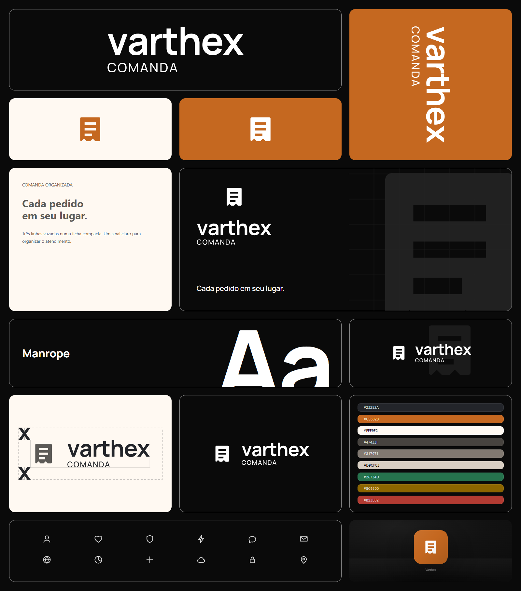

# Identidade visual

Identidade **Comanda Organizada**, aprovada em 30/09/2026: símbolo de ficha de pedido independente do nome Varthex, com laranja e grafite.

## Arquivos para uso

- [Logo principal em SVG](comanda-organizada/out/assets/01-logo/primary/logo-horizontal-primary.svg)
- [Símbolo em SVG](comanda-organizada/out/assets/02-symbol/symbol-brand.svg)
- [Ícone em PNG](comanda-organizada/out/assets/02-symbol/app-icon-1024.png)
- [Manual em PDF](comanda-organizada/out/assets/BRAND-MANUAL.pdf)
- [Arquivos exportados, variações e fontes](comanda-organizada/out/assets/)
- [Conceito e decisões de design](comanda-organizada/RATIONALE.md)

## Fontes editáveis

`comanda-organizada/brand.json` concentra as definições da identidade. Os vetores originais estão em `identity/src/`, os scripts de geração em `scripts/` e as apresentações em `pages/`. As fontes incluem suas licenças.

Os arquivos mantêm a identificação “proposta 1” para preservar a versão apresentada e aprovada. Esta entrega registra a identidade; sua aplicação no programa e no instalador será uma alteração separada.
